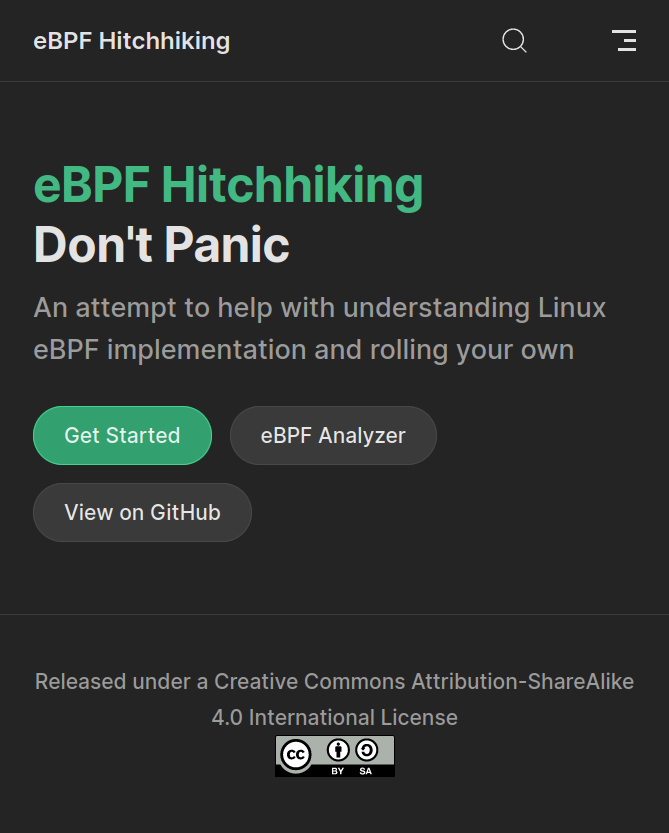

<style>
section {
  text-align: left;
  font-size: 28px;
}

ul {
  margin-left: 1em;
}

section::after {
  font-size: 0.8em;
}

table {
  width: 100%;
}
</style>
<style scoped>
section {
  text-align: center;
}
</style>

# eBPF 验证器

<br>

**ebpf-analyzer**
[github.com/yesh0/ebpf-analyzer](https://github.com/yesh0/ebpf-analyzer)

**ebpf-hitchhiking**
[yesh0.github.io/ebpf-analyzer](https://yesh0.github.io/ebpf-analyzer)

<br>
<br>
<br>

叶圣辉

<!-- 大家好，我做的主要是 eBPF 验证器相关的内容。但是在介绍我这部分内容之前，我们先来看看这方面目前的现状。 -->

---

### eBPF 相关项目介绍

<!--
eBPF 大概不用多加介绍了。eBPF 源与 Linux 内核，可以在操作系统内核中运行用户提供的经沙盒保护的程序。它可以在不改动内核或是内核模块的情况下安全地扩展内核的功能。
在 Linux 相关领域里它的应用当然很多啦。但是 Linux 生态里生态外其实也都有一大堆相关项目，这里进行一些介绍。

第一个要提的是 eBPF for Windows。它是在 Windows 上建立 eBPF 程序的运行环境的一个尝试。
它用到了很多下面列举了的项目，比如 PREVAIL 和 ubpf，最终实现了 eBPF 程序从验证到 JIT 到在内核里面运行的这样一个完整的流程。


-->

| [libbpf](https://github.com/libbpf/libbpf) | [generic-ebpf](https://github.com/generic-ebpf/generic-ebpf) |
|:------------------------------------------:|:------------------------------------------------------------:|
| eBPF 加载库                                | FreeBSD eBPF 体系尝试                                        |

| [ebpf-for-windows](https://github.com/microsoft/ebpf-for-windows) | [PREVAIL](https://github.com/vbpf/ebpf-verifier) |
|:-----------------------------------------------------------------:|:------------------------------------------------:|
| Windows 下的 eBPF 体系实现                                        | C++ 实现的 eBPF 验证器                           |

| [ubpf](https://github.com/iovisor/ubpf) | [rbpf](https://github.com/qmonnet/rbpf) |
|:---------------------------------------:|:---------------------------------------:|
| C 实现的用户态 eBPF 运行时              | Rust 实现的用户态 eBPF 运行时           |

| [bpf_conformance](https://github.com/Alan-Jowett/bpf_conformance) | [dthaler/ebpf-docs][dt] |
|:-----------------------------------------------------------------:|:-----------------------:|
| eBPF 的测例库                                                     | eBPF 新版文档           |

[dt]: https://github.com/dthaler/ebpf-docs/blob/update/isa/kernel.org/instruction-set.rst

<style scoped>
td, th {
  width: 50%;
}
</style>

---


- 验证器
  - 安全性保证
- Linux 验证器
  - 内核态验证
  - Linux 自用
  - 难以移植
- PREVAIL
  - 用户态验证
  - 内存开销大
  - 依赖标准库

<style scoped>
section {
  padding-left: 0;
  background: white;
}
section>ul {
  position: absolute;
  right: 0;
  background-color: white;
  padding: 8em 3em 8em 1.5em;
}
img {
  margin-top: 1.3em;
  margin-left: -1em;
}
</style>

---

<style scoped>
img {
  position: absolute;
  right: 0;
  top: 0;
  height: 100%;
}
ol {
  margin-left: 0.2em;
}
</style>

### 文档工作

1. **eBPF 标准汇总**

   - 当前 Linux 内核对<br>eBPF 的记录落后
   - eBPF 基金会正在努力<br>进行 eBPF 标准化

     - [dthaler/ebpf-docs](https://github.com/dthaler/ebpf-docs)<br>&nbsp;

2. **Linux eBPF 验证器实现**

   - 内部实现的大致原理
   - 验证的细节处理
   - 接口以及与其它的耦合<br>&nbsp;

3. 代码文档



<!--
eBPF 基金会有在进行 eBPF 的标准化工作，我这边的文档也记录了一些现有内核文档和实际行为的不符之处。
但是那边的工作看起来全面很多，总之把唯一一个看起来不太对劲的地方反馈过去之后可能考虑把我这方面的文档删掉，然后把链接指向那边。

另外的文档就是对 Linux 现有验证器的源码阅读笔记。

源码文档的话 `#[deny(missing_docs)]` 硬性要求所有公开的 API 都有文档，这方面应该还可以。
-->

---

### 验证器工作原理

1. 指令格式验证

2. 像是“单步执行一样”，一步一步模拟程序执行，将所有可能情况遍历，检查非法情况：
   - 与类型不符的操作（如 `ptr / 3` 或 `*NULL`）
   - 非法内存读写等等
   - 某种情况下总执行指令数过多（如进入了大的循环）

### 验证器功能

- 验证程序安全性
- 为后续步骤提供信息，如 JIT 时应分配的栈帧大小

---

### 验证器情况

- 独立为一个 crate
  - `Analyzer`
  - `AnalyzerConfig`
- 结合 GitHub CI 进行测试
- 与同学的 zCore 工作整合
  - 总共少于 20 行代码
  - 因没有用户态 libbpf 库的替代，未能进行 map 相关验证
- 代码文档使用 Rust 的 `#[deny(missing_docs)]` 进行硬性要求，缺失文档的话会直接报错

```rust
const ANALYZER_CONFIG: AnalyzerConfig =
  AnalyzerConfig {
    ...
  };

let result = Analyzer::analyze(
  bpf_insns,
  &ANALYZER_CONFIG
);
```

<style scoped>
pre {
  position: absolute;
  top: 6.4em;
  right: 2em;
  width: 30em;
}
</style>

---

### 脚手架工作：`opcode_match`

- Rust 下对 eBPF 指令的通常处理是一个大 `match`：

  ```rust
  // match ... {
  ALU_K_ADD => reg[dst] = (reg[dst] as i32).wrapping_add(imm) as u64,
  ALU_K_SUB => reg[dst] = (reg[dst] as i32).wrapping_sub(imm) as u64,
  ALU_K_MUL => reg[dst] = (reg[dst] as i32).wrapping_mul(imm) as u64,
  // }
  ```

  - 不易维护：写起来复制粘贴心烦，改起来慢，易错

- 利用 Rust 的宏功能定制一个处理高重复性动作的宏：

  ```rust
  opcode_match! {
      opcode,
      [[BPF_ALU: ALU], [BPF_K: K], [
          BPF_ADD: add,
          BPF_SUB: sub,
          BPF_MUL: mul,
      ]] => {
          reg[dst] = (reg[dst] as i32).#"wrapping_{}"(imm) as u64;
      }
  }
  ```

<style scoped>
h3 {
  margin-bottom: 0;
}
</style>

---

### 其它工作：JIT 编译器

使用 Cranelift 和 `opcode_match` 在 500 行代码左右实现了一个支持几乎完整功能+原子指令的 JIT 编译器
- 能够通过 `bpf_conformance` 的测试
- 编译器使用了验证器提供的函数信息，同时也能指导验证器 API 设计

本来打算放到 rCore Tutorial 里去和验证器一起跑一跑试试的，但是：
- Cranelift 曾经是 `no_std`，现在维护团队已经不打算维护 `no_std` 版本了，因此暂时没法在内核运行

---

### 其它工作：基于 `bpf_conformance` 的测试

`bpf_conformance` 看起来是 eBPF-for-Windows 方面的工作，可以用来测试解释器、编译器对标准的符合程度。

- 如：eBPF 标准要求 `VAL / 0 == 0, VAL % 0 = VAL`

  - 前面同学的解释器和 JIT 暂时还没有按标准来

- 解释器测试：较为简单

- JIT 测试：可能需要使用用户态 QEMU

  - uBPF 使用用户态 QEMU 在 x86_64 下运行 ARM64 的 JIT 测例

  - 配合 `bpf_conformance` 可以检查实现与 eBPF 标准的一致性

---

### eBPF 整体架构想法

Linux 下的从编译到用户 API 到内核里面的验证和 JIT 处理，这些很大程度上可以说是**一体**的。

|               | Linux  | 我们                             |
|---------------|:------:|:--------------------------------:|
| eBPF 程序编译 | LLVM   | LLVM                             |
| 用户 API 体系 | libbpf | &gt;&gt;&gt;**缺失**&lt;&lt;&lt; |
| 内核侧验证器  | 耦合   | ebpf-analyzer                    |
| 内核侧 JIT    | 耦合   | ebpf2rv                          |
| 内核侧运行时  | 耦合   | rCore-eBPF-enhancement           |

---

### 下一步

- 尝试继续使用验证器输出信息编写 JIT，用 QEMU 测试
- 根据 JIT 的需求进一步完善验证器
  - 更多的测试，并考虑进行分支合并的实现
  - 结合 JIT 以及移植的经验设计更易用的 API
  - 更详细的输出与报错信息
- 争取完善之后把验证器给放到 [ebpf.io](ebpf.io) 上去
  - ebpf.io 是一个相对官方的 eBPF 相关的介绍网站
  - 上面有一个页面是 eBPF Infrastructure Landscape

---

### 额外内容

这部分是期末展示完之后进行的。详细的请见 [./Changelog-Week16.org](./Changelog-Week16.org)

上面提到了我们离实现一个完整的 eBPF 系统还差一个 libbpf 替代。
正好有人用 Rust 实现了一个独立于 libbpf 的加载库：[Aya](https://github.com/aya-rs/aya/)。

它其实现在还是主要按 Linux 来的：它需要用到 Linux 的系统调用，而我们的 rCore-Tutorial,
rCore 或者 zCore 都还没办法做到与 Linux 的完全兼容（也不敢说能兼容 Rust std，
它不是 `no_std` 的）。所以我们没办法直接使用 Aya。

针对这一点我提了一个 issue（[#473](https://github.com/aya-rs/aya/issues/473)）
以及一个 PR（[#475](https://github.com/aya-rs/aya/pull/475)），
希望可以把与 Linux 无关的那部分代码独立出一个 `no_std` 的 crate。

现在这个 PR 还在等 review。如果最终能弄好的话，之后的同学应该可以轻松一点。

---

### 谢谢大家！
